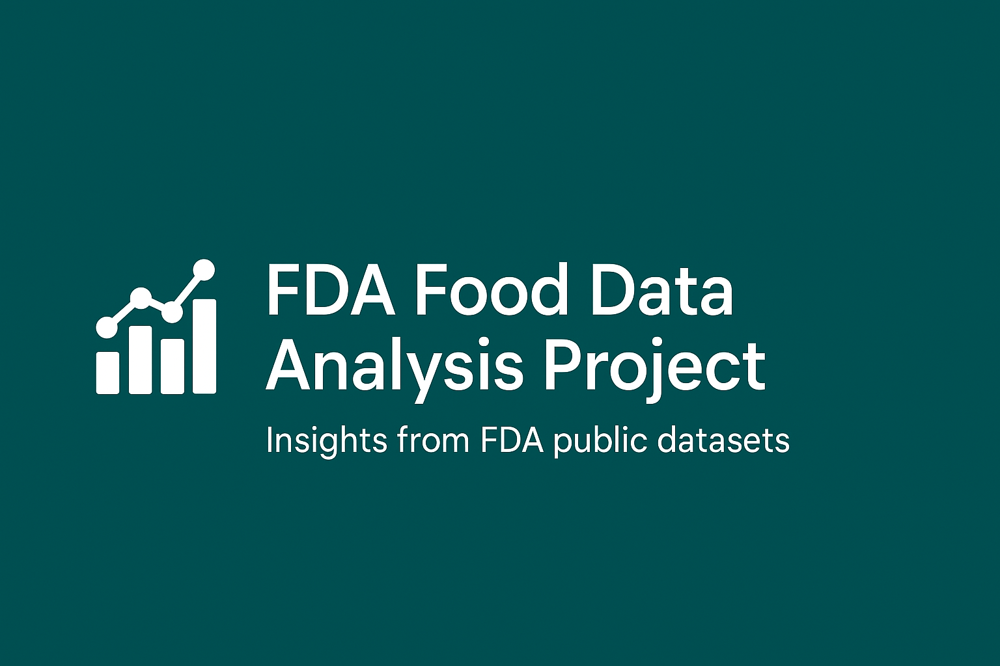
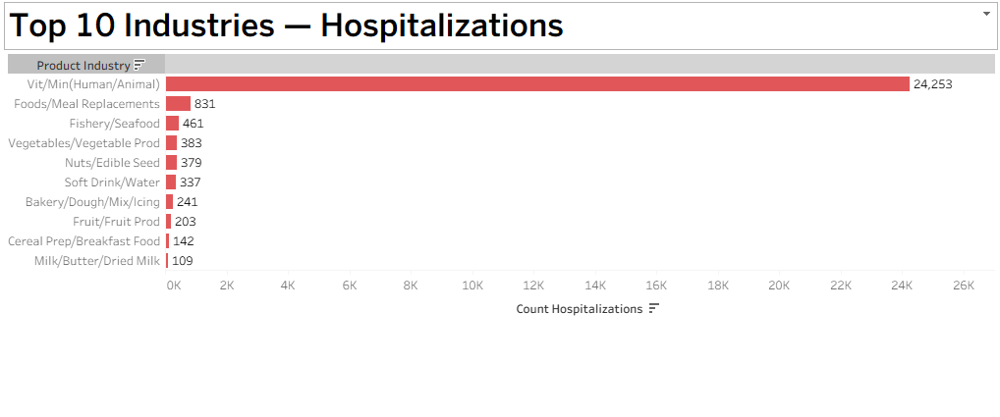

# FDA Food Data Analysis Project

---

  
*Example visualization or project banner here*

---

## 🚀 Project Overview

This project explores **FDA public datasets** related to **food complaints, adverse events, and product recalls**. Using **BigQuery SQL**, the analysis identifies key trends to help prioritize food safety interventions and improve public health outcomes.

---

## 📊 Tools & Data Sources

- **Data Source:** [FDA Food Dataset (BigQuery Public)](https://console.cloud.google.com/bigquery?ws=!1m4!1m3!3m2!1sbigquery-public-data!2sfda_drug) 
- **Tools:** Google BigQuery, Tableau (for visualization)  
- **Skills Demonstrated:** SQL querying, data cleaning, analysis, public health data insight

---

## 🔍 Analysis Highlights & Queries

### 1. Top Industries by Complaints  
*Identifies which industries receive the most consumer complaints.*

> See full query in [`sql/top_industries_by_complaints.sql`](./sql/top_industries_by_complaints.sql)

---

### 2. Top Industries by Hospitalizations  
*Focuses on complaints resulting in hospital visits for more serious insights.*

> See full query in [`sql/top_industries_by_hospitalizations.sql`](./sql/top_industries_by_hospitalizations.sql)

---

### 3. Top Adverse Events  
*Lists the most common consumer-reported reactions or symptoms.*

> See full query in [`sql/top_adverse_events.sql`](./sql/top_adverse_events.sql)

---

### 4. Recent Food Recalls  
*Displays the most recent food recalls and reasons behind them.*

> See full query in [`sql/recent_food_recalls.sql`](./sql/recent_food_recalls.sql)

---

### 5. Recall Classification Distribution  
*Shows recall severity by product type for the top 10 product categories.*

> See full query in [`sql/recall_classification_distribution.sql`](./sql/recall_classification_distribution.sql)

---

## 📈 Visualizations

Visualizations created from query results provide actionable insights and are saved in the `visualizations/` folder.

*Example: Bar chart showing top industries by hospitalizations.*

---

## ⚙️ How to Use This Project

1. Explore the SQL queries inside the [`sql/`](./sql) folder.  
2. Run queries in [BigQuery Console](https://console.cloud.google.com/bigquery).  
3. Save results as tables or export for further analysis.  
4. Use Tableau for advanced visualizations.  

---

## 👩‍💻 About Me

This project demonstrates my expertise in healthcare data analytics, SQL querying, and visualization — highlighting my ability to turn public datasets into meaningful, data-driven insights.

---

*Thank you for reviewing my project! Feel free to reach out for collaboration or questions.*

---
